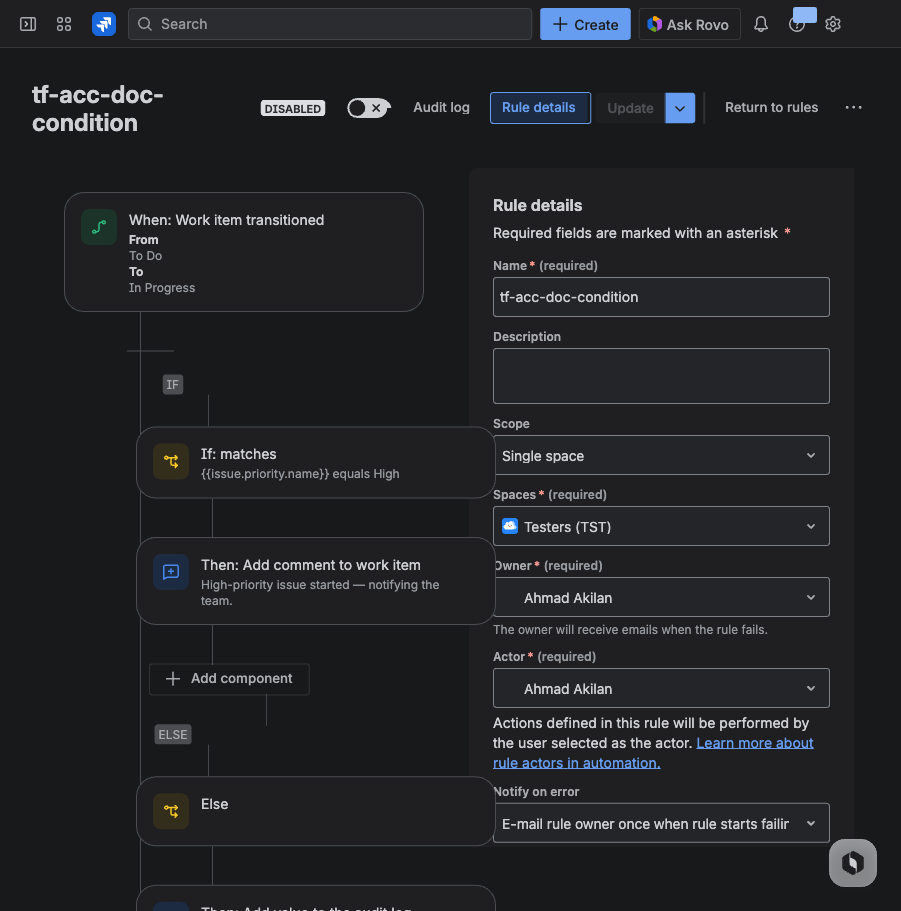

# terraform-provider-jira-automation

A Terraform provider for managing Jira Automation rules via the Automation Rule Management REST API.

<table style="table-layout:fixed;width:100%">
<tr><th width="50%">HCL Config</th><th width="50%">Jira UI</th></tr>
<tr valign="top">
<td>

```hcl
resource "jira-automation_rule" "cond" {
  name       = "Comment on high-priority issues"
  project_id = "10001"

  trigger = {
    type = "status_transition"
    args = {
      from_status = "To Do"
      to_status   = "In Progress"
    }
  }

  components = [{
    type = "condition"
    args = {
      first    = "{{issue.priority.name}}"
      operator = "equals"
      second   = "High"
    }
    then = [{
      type = "comment"
      args = {
        message = "High-priority issue started"
      }
    }]
    else = [{
      type = "log"
      args = {
        message = "Normal priority — no action"
      }
    }]
  }]
}
```

</td>
<td>

</td>
</tr>
</table>

> One HCL block → the provider generates the [nested API JSON](testdata/golden/condition_then_else.json) → Jira renders the visual workflow.

## Core Capabilities

**B.Y.O.A. (Bring Your Own Agent)**
: Automation rules are plain text that any AI coding assistant (Claude Code, Cursor, Copilot, etc.) can read, write, and refactor. No lock-in to Atlassian's own AI tooling.

**Prebuilt components**
: Common webhook patterns (see [component types](#component-types)) are packaged as reusable components — no need to hand-craft API payloads yourself.

**Raw JSON fallback**
: `trigger_json` and `components_json` accept any valid JSON for uncovered types — you're never blocked.

**Easy debugging**
: Add `debug = "true"` to any component's `args` to inject diagnostic log actions that dump runtime values. Remove the arg and `terraform apply` cleans them up — no manual editing of rules in Jira.

**Built-in agent skills**
: Ships with agent skill files (`.claude/skills/`) that capture tacit API knowledge — envelope requirements, read-modify-write patterns, component ID handling — so coding agents work without reverse-engineering.

## Prerequisites

- [Terraform](https://developer.hashicorp.com/terraform/install) 1.5+ (required for `import` blocks and config generation)
- A Jira Cloud site with an [API token](https://id.atlassian.com/manage-profile/security/api-tokens)

> **Label setup:** Create a label named `managed-by:terraform` in the Jira Automation UI
> (Project Settings → Automation → Labels) before using this provider. The provider will
> tag all managed rules with this label so you can filter Terraform-managed rules.

## Setup

### 1. Set environment variables

The provider needs three values. You can pass them via environment variables
so they don't need to be hardcoded in `.tf` files.

Create a `.env` file in the directory where your `.tf` files live (e.g. `beno/.env`):

```bash
export ATLASSIAN_SITE_URL=https://yoursite.atlassian.net
export ATLASSIAN_USER=you@example.com
export ATLASSIAN_TOKEN=your-api-token
```

Then **before running any `terraform` command**, load them into your shell:

```bash
source .env
```

The full list of supported env vars:

| What | Env vars (checked in order) |
|------|-----------------------------|
| Site URL | `JIRA_SITE_URL`, `ATLASSIAN_SITE_URL` |
| Email | `JIRA_EMAIL`, `ATLASSIAN_USER` |
| API Token | `JIRA_API_TOKEN`, `ATLASSIAN_TOKEN` |

### 2. Write your Terraform config

Create a directory for your project (e.g. `my-jira/`) and add a file called `main.tf`:

> **How Terraform reads files:** Terraform loads *all* `.tf` files in the current
> directory and merges them together. File names don't matter — `main.tf`,
> `rules.tf`, `foo.tf` are all treated the same. The convention is to put
> provider config in `main.tf` and resources in other files, but it's just a
> convention.

`main.tf`:

```hcl
terraform {
  required_providers {
    jira-automation = {
      source = "registry.terraform.io/beno/jira-automation"
    }
  }
}

# This block is always required. When all three values come from env vars,
# it can be empty like this:
provider "jira-automation" {}
```

You can also hardcode values directly in the provider block (useful if you
don't want to deal with env vars):

```hcl
provider "jira-automation" {
  site_url  = "https://yoursite.atlassian.net"
  email     = "you@example.com"
  api_token = "your-api-token"   # sensitive — prefer env vars
}
```

Or mix and match — any attribute set in the block takes priority over env vars.

### 3. Run Terraform

```bash
cd beno                  # wherever your .tf files are
source .env
terraform plan           # preview what Terraform will do
terraform apply          # execute it
```

## Provider Configuration Reference

| Attribute   | Type   | In HCL | Env Var Fallback |
|-------------|--------|--------|------------------|
| `site_url`  | string | optional | `JIRA_SITE_URL`, `ATLASSIAN_SITE_URL` |
| `email`     | string | optional | `JIRA_EMAIL`, `ATLASSIAN_USER` |
| `api_token` | string | optional | `JIRA_API_TOKEN`, `ATLASSIAN_TOKEN` |

All three must be provided — either in the provider block, via env vars, or a combination.
The `provider "jira-automation" {}` block itself is always required by Terraform, even if empty.

## Resources

### `jira-automation_rule`

Manages a single Jira Automation rule.

```hcl
resource "jira-automation_rule" "example" {
  name    = "My Rule"
  enabled = true

  trigger_json = jsonencode({
    component     = "TRIGGER"
    schemaVersion = 1
    type          = "jira.issue.event.trigger:transitioned"
    value = {
      fromStatus = [{ type = "NAME", value = "To Do" }]
      toStatus   = [{ type = "NAME", value = "In Progress" }]
    }
  })

  components_json = jsonencode([
    {
      component     = "ACTION"
      schemaVersion = 1
      type          = "codebarrel.action.log"
      value         = "Hello from Terraform"
    }
  ])
}
```

#### Attributes

| Attribute | Type | Required | Description |
|-----------|------|----------|-------------|
| `id` | string | computed | Rule UUID (set on create/import) |
| `name` | string | required | Rule name |
| `enabled` | bool | optional | Enable/disable (default: `true`) |
| `state` | string | computed | `ENABLED` or `DISABLED` |
| `scope` | list(string) | computed | Scope ARIs assigned by the API |
| `labels` | list(string) | computed | Rule labels (read-only). Auto-tagged with `managed-by:terraform`. |
| `trigger_json` | string (JSON) | required | Trigger config — use `jsonencode()` |
| `components_json` | string (JSON) | required | Actions/conditions array — use `jsonencode()` |

`trigger_json` and `components_json` use semantic JSON comparison, so whitespace and key ordering differences won't show as drift.

#### Component types

Structured `component` block types that replace raw JSON with simple HCL arguments:

| Type | Wraps API type | Description |
|------|---------------|-------------|
| `add_release_related_work` | `jira.issue.outgoing.webhook` | Add a related item to a release via webhook |

#### Importing an Existing Rule

> **Why not `terraform import`?** The CLI command `terraform import` requires
> you to write the full `resource` block first — including `trigger_json` and
> `components_json`. For automation rules with complex configs, that's
> impractical. The `import` block approach below lets Terraform generate the
> resource configuration from the live API automatically.

To bring a pre-existing Jira Automation rule under Terraform management:

**1. Find the rule UUID.** Open the rule in Jira — the URL contains the ID after `#/rule/`:

```
https://yoursite.atlassian.net/jira/settings/automate#/rule/<rule-uuid>
```

**2. Create `imports.tf`.** In your project directory (next to `main.tf`), create a file called `imports.tf`:

```hcl
import {
  to = jira-automation_rule.my_rule
  id = "01997721-1866-7233-9bb8-cec4a4614919"
}
```

> `my_rule` is the Terraform resource name — you choose it. It's how you'll
> refer to this rule in your `.tf` files. Use something descriptive like
> `attach_test_report` or `notify_on_release`.

**3. Generate the resource configuration.** Terraform can auto-generate the `resource` block from the API. Run this from your project directory:

```bash
terraform plan -generate-config-out=generated.tf
```

This creates a file called `generated.tf` with the full resource block, including `trigger_json` and `components_json` populated from the live rule.

**4. Review and apply.**

```bash
terraform plan    # preview the import
terraform apply   # import into state
```

**5. Clean up.** After the import succeeds, delete `imports.tf` — it was only needed for the one-time import. Rename `generated.tf` to something descriptive (e.g. `rule_my_rule.tf`).

```bash
rm imports.tf
mv generated.tf rule_my_rule.tf
```

**6. Verify.** A subsequent `terraform plan` should show no changes:

```bash
terraform plan
# No changes. Your infrastructure matches the configuration.
```

#### Destroy behavior

The Jira Automation API has **no DELETE endpoint**. Running `terraform destroy` will **disable** the rule instead of deleting it. A warning is shown when this happens.

## Data Sources

### `jira-automation_rules`

Lists all automation rule summaries.

```hcl
data "jira-automation_rules" "all" {}

output "rules" {
  value = data.jira-automation_rules.all.rules
}
```

Each entry in `rules` has: `uuid`, `name`, `state`, `enabled`.

## Development

### Building from source

Requires [Go](https://go.dev/dl/) 1.23+.

```bash
cd terraform-provider-jira-automation
make build          # compile the binary
make install        # install to ~/.terraform.d/plugins/
make dev.tfrc       # generate a portable dev override config
```

To use the local build instead of a registry download:

```bash
export TF_CLI_CONFIG_FILE="$(pwd)/dev.tfrc"
terraform plan      # uses the local binary, no init needed
```

### Running tests

**Unit tests** (no credentials needed):

```bash
make test
```

**Acceptance tests** (requires a live Jira instance):

```bash
make testacc
```

Run a single acceptance test:

```bash
TF_ACC=1 go test ./internal/provider/ -v -run TestAccRuleResource_basic -timeout 10m
```

#### Test environment variables

| Variable | Required by |
|----------|-------------|
| `TF_ACC=1` | All acceptance tests (framework gate) |
| `JIRA_SITE_URL` (or `ATLASSIAN_SITE_URL`) | All acceptance tests |
| `JIRA_EMAIL` (or `ATLASSIAN_USER`) | All acceptance tests |
| `JIRA_API_TOKEN` (or `ATLASSIAN_TOKEN`) | All acceptance tests |
| `JIRA_TEST_PROJECT_ID` | Tests with project-scoped triggers |
| `JIRA_WEBHOOK_USER` | `add_release_related_work` tests |
| `JIRA_WEBHOOK_TOKEN` | `add_release_related_work` tests |

The test Jira project needs a workflow with "To Do" and "In Progress" statuses (standard defaults).

#### Test conventions

- Unit tests: `Test*` (e.g. `TestBuildLog`, `TestResolveAliases`)
- Acceptance tests: `TestAcc*` (e.g. `TestAccRuleResource_basic`)
- All acceptance test rules are prefixed `tf-acc-` and labeled `tf-acc-test`
- Tests run serially (no `t.Parallel()`) to avoid API rate limits

#### CI

CI runs unit tests on all pushes and PRs. Acceptance tests run on pushes to `main` and via manual workflow dispatch (requires `jira-test` environment secrets).

#### Cleanup

Acceptance test rules accumulate as disabled rules (the API has no DELETE endpoint). Periodically clean via Jira UI by filtering on the `tf-acc-test` label.

## Troubleshooting

**"could not find executable file starting with terraform-provider-jira-automation"** — The binary hasn't been built. Run `make build` from the `terraform-provider-jira-automation/` directory.

**"requires explicit configuration"** — You need a `provider "jira-automation" {}` block in your `.tf` file. Terraform always requires this, even when all values come from env vars.

**"Missing site_url"** — The env var isn't reaching Terraform. Make sure you ran `source .env` and that your `.env` file has `export` prefixes on each variable.

**"empty cloudId from tenant info"** — Make sure `site_url` is your full Jira Cloud URL (e.g. `https://yoursite.atlassian.net`), not an API URL.

**401 Unauthorized** — Check that your email and API token are correct. API tokens are created at https://id.atlassian.com/manage-profile/security/api-tokens.

**No changes detected after modifying JSON** — The JSON fields use normalized comparison. If only whitespace or key order changed, Terraform correctly sees no diff.
